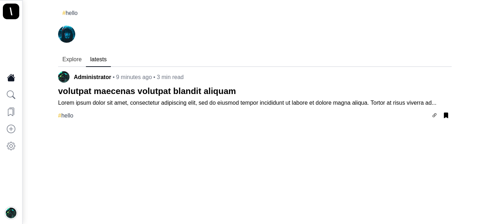
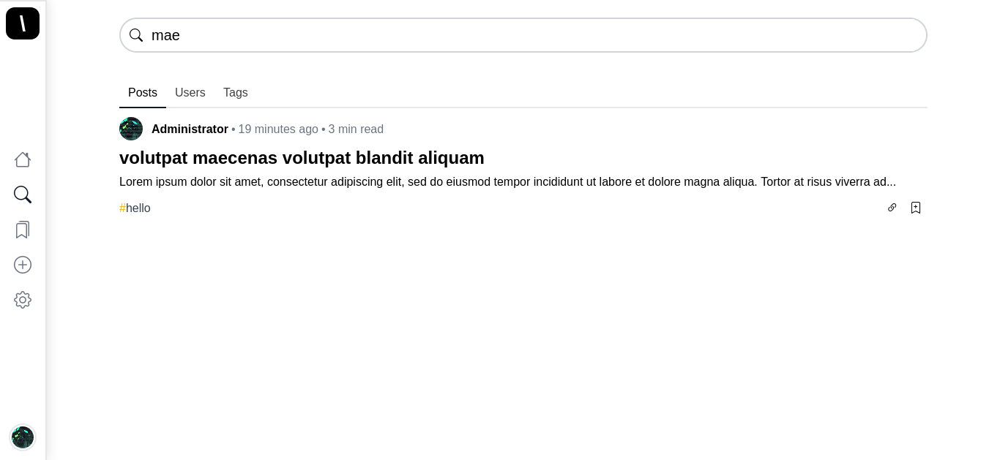
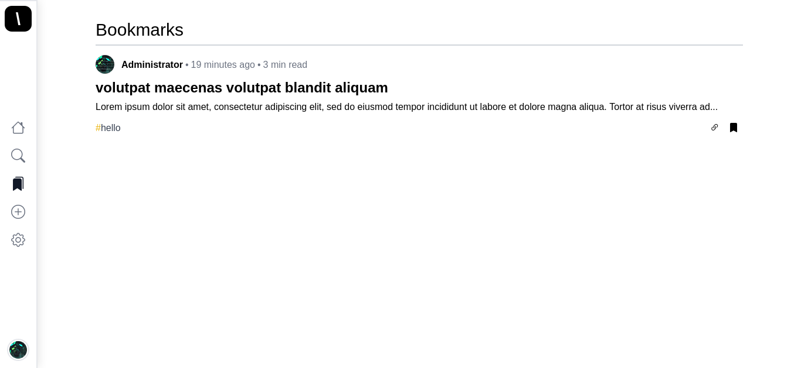
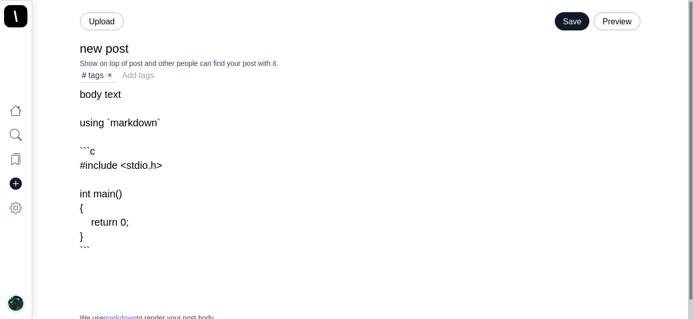
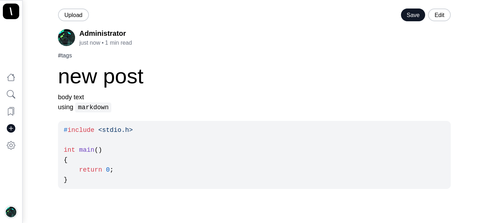
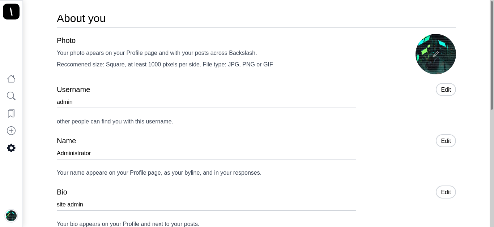
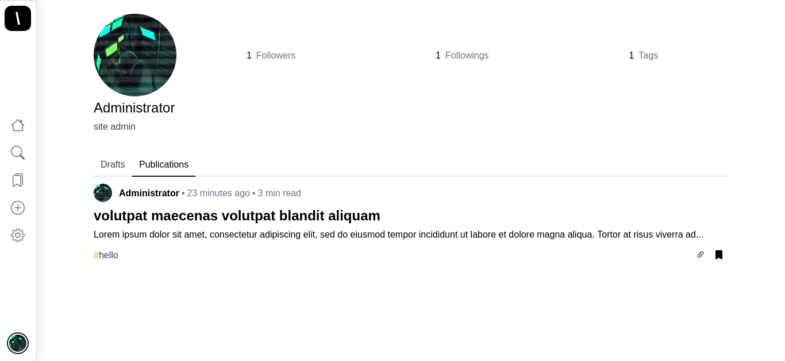
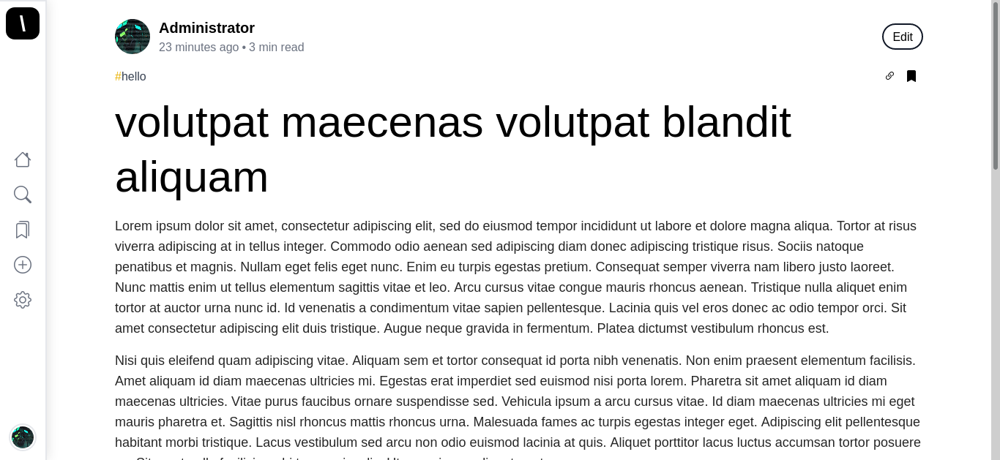
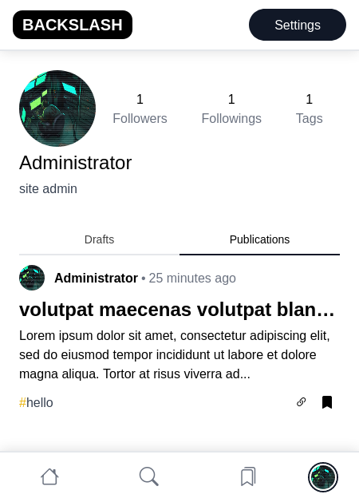

# BACKSLASH Project
Backslash is a blog system using Markdown to write posts. Every user can write post and follow other users and hashtags. (EMAIL SYSTEM IS NOT READY) 

## TODO
- [x] Email system

## Index page

## Search page

## Bookmark page

## Create new post

## Preview of post

## Preview of post

## Dashboard menu (Settings)

## User Profile

## Post view

## All Pages Are Full Responsive

